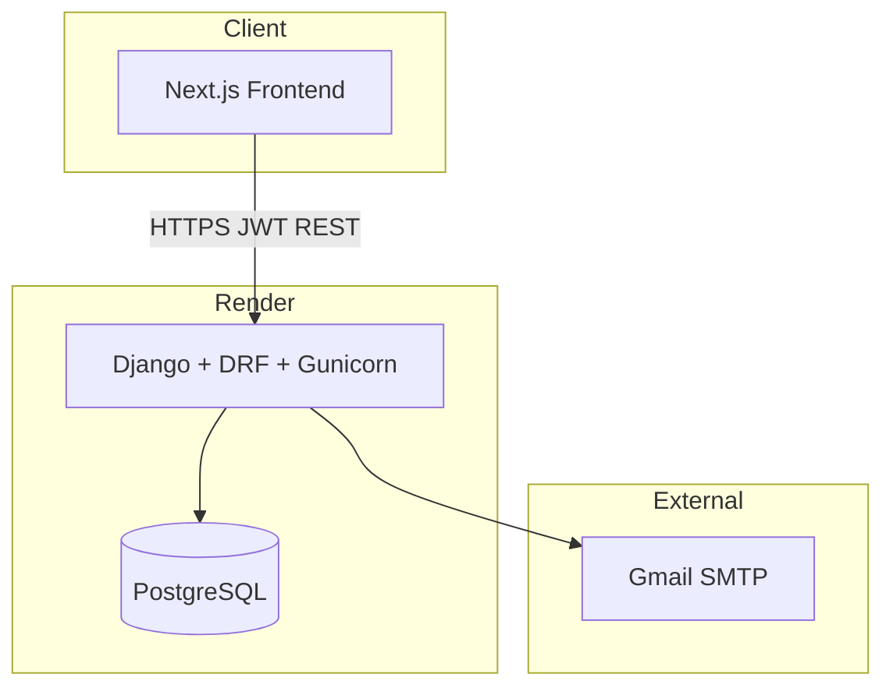
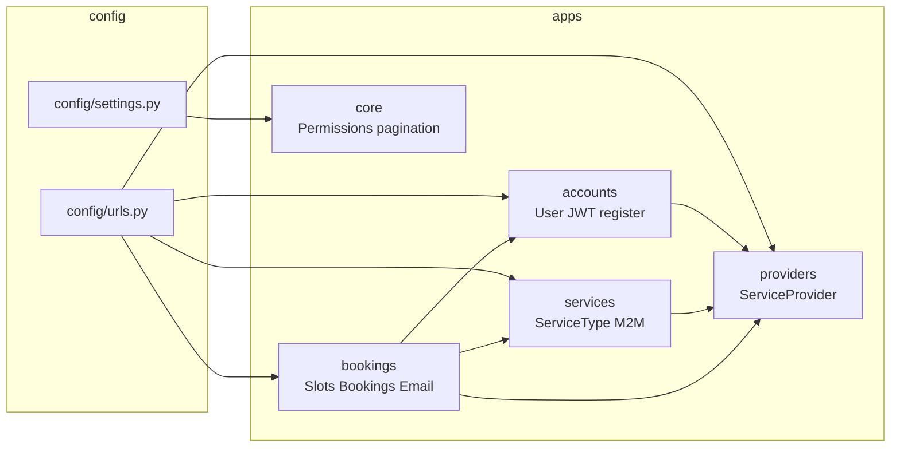
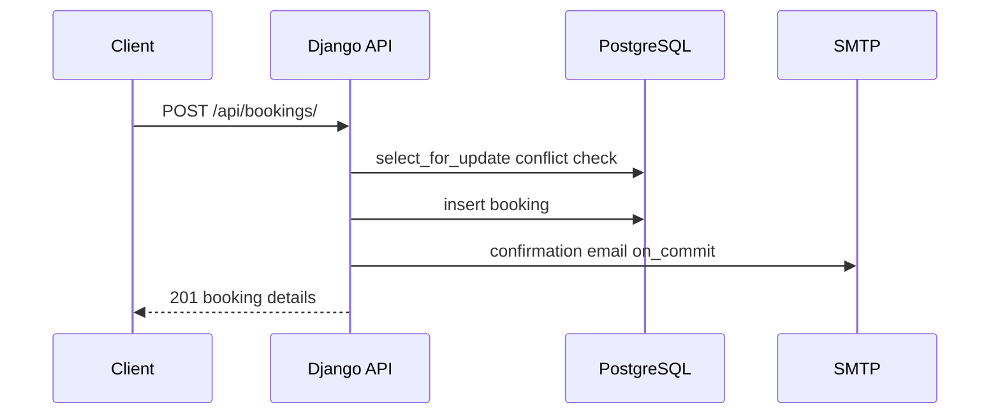
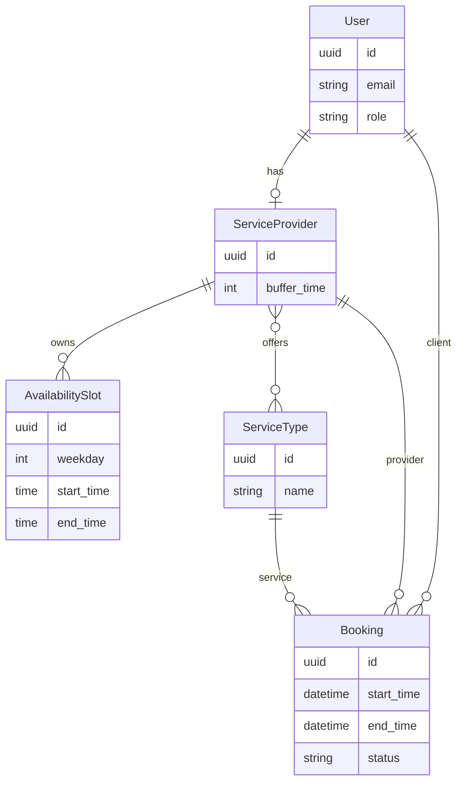

# System Design — Appointment Booking API

Use this file for your submission diagram link (GitHub raw URL, or export PNG from [mermaid.live](https://mermaid.live)).

## Architecture

## Components

## Booking flow

## Data model

## Roles

| Role | Access |
|------|--------|
| client | book, view own bookings, cancel own |
| provider | manage availability, view schedule |
| admin | users, services, all bookings |

## Stack

| Layer | Technology |
|-------|------------|
| API | Django 5.2, DRF, SimpleJWT |
| Database | PostgreSQL |
| Docs | drf-spectacular Swagger |
| Deploy | Docker, Render, GitHub Actions |
| Email | SMTP + management command reminders |
